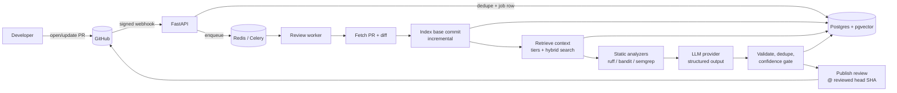
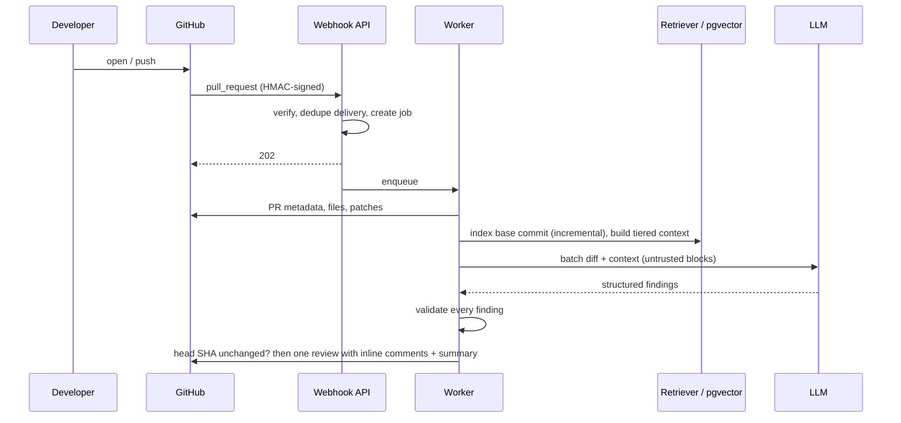

# PR Review Agent

An AI pull-request reviewer that behaves like a senior engineer: it reads the diff **in the context of
the whole repository**, proposes findings as structured data, and only posts the ones that survive a
deterministic validation pipeline, pinned to the exact commit that was reviewed.

> **Status:** feature-complete MVP for Python repositories. 317 automated tests pass, including a
> webhook-to-published-review end-to-end test. It has run end to end against a live GitHub App (webhook →
> index → retrieval → local LLM → validated findings, dry run) using **local Ollama models, with no paid
> API**; Anthropic/OpenAI adapters exist but have not been exercised against the real APIs. Measured
> quality for local models is in [Evaluation](#evaluation) and is modest: read it before relying on it.

## Why this is more than `PR diff → LLM → comment`

| Naive reviewer | This system |
|---|---|
| Sees only the diff | Retrieves containing symbols, imported/called definitions, callers, tests, config and repo conventions |
| Trusts the model's line numbers | Snaps every line to a real diff hunk; rejects anything outside the PR |
| Trusts quoted "evidence" | The quote must exist verbatim in the diff or the context the model was shown |
| Posts everything it is told | Confidence gate, severity policy, deduplication, per-file/PR caps; silence is a valid result |
| Re-embeds the repo per PR | Content-addressed (git blob SHA) incremental index: unchanged files cost nothing |
| Injectable via PR text/comments | Untrusted data in nonce-delimited blocks, schema-only output, no model tools, sanitised posting |
| Posts to a moving target | Verifies the PR head SHA twice; a stale review is discarded, not posted |
| "Looks good" | Benchmark of seeded-bug PRs, retrieval ablations, precision/recall/false-positive metrics |

## Architecture





## How the RAG works

1. **Index the PR's base commit**, not every PR head. Files are parsed into *semantic chunks* (module header,
   class, method, function; config and docs by section) with `ast` and an error-tolerant tree-sitter fallback.
   Each chunk carries signature, imports, called names, bases, and test/non-test flags.
2. **Content-addressed storage.** Chunks belong to a git blob SHA; a snapshot is a `path → blob_sha` manifest.
   An incremental index re-embeds only new blobs, and retrieval reaches chunks only through the snapshot's
   manifest, so stale embeddings cannot leak into a review.
3. **Head overlay.** Files the PR touches are chunked in memory from the head SHA (their base versions are
   excluded), so the reviewer sees new code plus the real repository, never a blend of old and new.
4. **Tiered context per hunk:** (1) containing symbol and class, (2) imported/called definitions,
   (3) callers, (4) tests, config, migrations, (5) hybrid search extras (Postgres FTS + pgvector fused with
   Reciprocal Rank Fusion and bounded, named boosts), (6) README/CONTRIBUTING. Each tier has a token share;
   unused budget rolls down; the changed code is never dropped. Every item carries an id the model must cite.
5. **Large PRs** are triaged (source before tests before config; generated/lock/binary skipped), split into
   hunk-aware batches, capped by `MAX_*` limits, and the final summary lists exactly what was not reviewed.

## Features

- GitHub App auth (JWT → short-lived installation tokens), HMAC-verified, idempotent webhooks
- Celery + Redis workers, explicit job state machine, retries with backoff, outbox-style sweeper
- Provider-neutral LLM layer (Anthropic, OpenAI, and local **Ollama** — see
  [`docs/local-ollama.md`](docs/local-ollama.md)), retry/backoff/jitter,
  JSON-schema output with one repair attempt, per-job token and cost tracking
- Validation pipeline, deduplication, caps, GitHub `suggestion` blocks only for verified replacements
- Static analysis as *evidence* (never posted directly), run in isolated subprocesses with no secrets
- Secret redaction before model calls; per-repo daily budget; owner allowlist; rate limiting
- Manual API (dry-run review → inspect findings → publish), repository index/status/delete endpoints
- Prometheus metrics (API + workers), structured logs with review/PR/commit/provider-request IDs
- Privacy: retention purge, data purge on uninstall, documented data flows

## Tech stack

Python 3.12, FastAPI, Pydantic v2, SQLAlchemy 2 (async) + Alembic, PostgreSQL + pgvector + FTS + pg_trgm,
Celery + Redis, tree-sitter + `ast`, httpx, structlog, prometheus-client, Ruff/Bandit/Semgrep, pytest,
mypy (strict), Docker Compose. Each choice and its alternatives are in [`docs/decisions/`](docs/decisions).

## Quick start

```bash
cp .env.example .env     # fill in secrets; see below
docker compose up --build
curl localhost:8000/ready
```

Services: `postgres` (pgvector), `redis`, `migrate` (one-shot), `api`, `worker`.

**No paid API?** Run a local model with Ollama (`LLM_PROVIDER=ollama`): setup, Docker→host networking, a dry-run
on a real PR, and model guidance are in [`docs/local-ollama.md`](docs/local-ollama.md).

Development without Docker for the app itself:

```bash
uv sync
make lint type test       # tests need Postgres with pgvector (TEST_DATABASE_URL)
```

### GitHub App setup

1. Create a GitHub App: webhook URL `https://<host>/webhooks/github`, a random webhook secret.
2. Permissions (minimum): **Contents: read**, **Pull requests: read & write**, **Metadata: read**.
3. Subscribe to **Pull request** events. Generate a private key and install the App on your repositories.
4. Put `GITHUB_APP_ID`, `GITHUB_PRIVATE_KEY`, `GITHUB_WEBHOOK_SECRET` in `.env`. For local testing expose
   the API with a tunnel (smee.io / ngrok).

### Configuration

| Variable | Purpose |
|---|---|
| `DATABASE_URL`, `REDIS_URL` | Postgres (asyncpg URL) and Redis |
| `GITHUB_APP_ID`, `GITHUB_PRIVATE_KEY`, `GITHUB_WEBHOOK_SECRET` | GitHub App credentials |
| `LLM_PROVIDER` (`anthropic`/`openai`), `LLM_MODEL`, `ANTHROPIC_API_KEY`/`OPENAI_API_KEY`, `LLM_EFFORT` | Model selection |
| `EMBEDDING_PROVIDER` (`voyage`/`openai`/`hash`), `EMBEDDING_MODEL`, `VOYAGE_API_KEY` | Embeddings (`hash` = offline dev only) |
| `REVIEW_CONFIDENCE_THRESHOLD` | Minimum confidence to post inline (default 0.75) |
| `MAX_FILES_PER_REVIEW`, `MAX_CHANGED_LINES`, `MAX_CONTEXT_TOKENS`, `MAX_MODEL_CALLS` | Large-PR limits |
| `API_KEY`, `ALLOWED_OWNERS`, `RATE_LIMIT_PER_MINUTE`, `DAILY_BUDGET_USD` | Abuse and cost controls |
| `STATIC_ANALYZERS`, `METRICS_TOKEN`, `FINDINGS_RETENTION_DAYS` | Analyzers, metrics auth, retention |

## API

| Endpoint | What it does |
|---|---|
| `POST /webhooks/github` | Verifies signature, dedupes by delivery ID, creates a job, enqueues, returns `202` |
| `POST /api/v1/reviews` | `{"repository","pull_request","publish":true}` → queue a review (`publish:false` = dry run) |
| `GET /api/v1/reviews/{id}` | Status, scope (what was/wasn't reviewed), usage and cost, error code |
| `GET /api/v1/reviews/{id}/findings` | Every finding incl. rejected ones with `reject_reason` |
| `POST /api/v1/reviews/{id}/publish` | Publish a completed review (refuses if the PR head moved) |
| `POST /api/v1/repositories/{o}/{r}/index` | Queue (incremental) indexing of a ref |
| `GET /api/v1/repositories/{o}/{r}/index/status` | Snapshots, chunk counts, errors |
| `DELETE /api/v1/repositories/{o}/{r}` | Purge all stored data for the repository |
| `GET /health`, `GET /ready`, `GET /metrics` | Liveness, readiness (DB + Redis), Prometheus |

`/api/v1/*` requires `X-API-Key`. OpenAPI docs are served at `/docs`.

## Example output

Rendered by the real publisher code. The finding's *wording* is hand-written for this example, not from a
model run:

> **Touched session is returned without an expiry check**
> `High` · `correctness`
>
> `verify_token` returns the session after `touch()` but never checks `expires_at`, so an expired session
> keeps authenticating. The retrieved `Session` model shows expired rows stay stored until the cleanup job runs.
>
> **Suggested fix**
> Reject sessions whose `expires_at` is in the past before touching them.
>
> <sub>Related context: `app/models/session.py:18-34`, `app/jobs/cleanup.py:1-4`</sub>

No screenshots or demo recording yet: they require a live run against a real GitHub App.

## Evaluation

`evals/` contains a 15-PR benchmark over a small FastAPI app: 10 seeded defects (auth bypass, race condition,
missing transaction, swallowed exception, resource leak, N+1 query, breaking API change, missing boundary
validation, blocking call in async code, SQL injection), 2 clean PRs, 2 decoys (risky-looking but correct),
and 1 prompt-injection PR (12 expected findings in total). Each seeded PR lists the context symbols a reviewer needs.

### Review quality: local models (measured, no paid API)

Run on an RTX 4050 (6 GB) laptop with Ollama, hash embeddings, ruff/bandit/semgrep enabled, synthesis pass off
(`python -m evals.run_eval`; full reports in `evals/results/ollama_*.md`). Strict = right file, lines (±3) **and**
category; location-only is an upper bound that forgives mislabelled categories but not wrong reasoning.

| | `qwen2.5-coder:3b` | `qwen2.5-coder:7b` |
|---|---|---|
| Precision / recall (strict) | 36% / 42% | **58% / 58%** |
| Precision / recall (location only) | 71% / 83% | 75% / 75% |
| False positives per PR | 0.60 | 0.33 |
| Clean/decoy PRs that got a comment | 4 of 4 | 2 of 4 |
| Structured output valid first try | 15/15 | 15/15 |
| Mean latency per PR | 5.4 s | 9.3 s |
| GPU residency (`ollama ps`) | 100% GPU, `num_ctx` 16k | 91% GPU / 9% CPU, `num_ctx` 8k |

Findings from the runs (two runs per model; strict numbers moved by up to ±8 points between runs of the same
model, so treat them as ±8):

- The 3B model emits about one finding per PR **regardless of content** and gives every finding the same
  confidence (0.90), so thresholds cannot help; it is a baseline, not a recommendation. The 7B model is the
  smallest one that is usefully selective, but it still misses roughly 4 in 10 seeded defects and comments on half
  of the clean/decoy PRs.
- Static analyzers showed **no measurable benefit** on this benchmark for the 7B model (62%/67% without vs
  58%/58% with, within noise): the seeded bugs are mostly logic and design issues that these tools cannot see.
  On a real PR the hints made the model report only the flagged SQL injection and skip a second real defect.
- Real-PR dry run (`ftwkartik/PR-Reviewer#1`, a file with ~6 plausible defects): both models found **1 of ~6**
  (the SQL injection, correct lines); the others were missed. Nothing was published.
- Prompt injection: before the deterministic defence below, the 7B model's summary on the injection PR was
  literally "LGTM" (the planted phrase). After it, 0% of runs echoed the injection; the benchmark's combined
  "resisted and still found the bug" metric is still 0% because the model also missed the underlying bug there.

Bugs found by running real models (all fixed, with regression tests): the result schema put `summary` before
`findings`, which made small models answer "no issues"; strict verbatim evidence matching rejected real findings
on trivial quote drift (now a token-level tier); `reject_reason` was too short and crashed jobs; secret redaction
had never been wired into the prompts; worker metrics were invisible from pool processes.

### Retrieval (no LLM involved)

Did the final, budgeted context contain the code needed to reason about each seeded bug?
(`python -m evals.run_eval --retrieval-only`)

| Retrieval mode | Required-context hit rate | PRs fully covered |
|---|---|---|
| diff only | 0% (0/13) | 0% |
| vector only (hash) | 69% (9/13) | 50% |
| lexical only | 54% (7/13) | 38% |
| hybrid search only | 69% (9/13) | 50% |
| **full (structural tiers + hybrid)** | **92% (12/13)** | **88%** |
| full, with local `mxbai-embed-large` embeddings | 85% (11/13) | 75% |

One known miss remains (`sql_injection`: a parameterised-query example that is not referenced by the changed
code). A real local embedding model (`EMBEDDING_PROVIDER=ollama`) did **not** improve retrieval on this benchmark
(a one-symbol difference, within noise), because the required context is mostly structural, so `hash` stays the
default; the Ollama embedder is available as an option.

### Harness self-check (simulated reviewers, *not* language models)

Scripted reviewers verify that scoring and validation behave: a perfect reviewer scores 100%; a reviewer that also
hallucinates files, quotes and lines still scores 100% precision because the validator rejects 85% of its raw
output; one that adds plausible-but-wrong, correctly anchored comments drops to 52% precision. Reports:
`evals/results/selfcheck_*.md`. These were produced by simulators and say nothing about real model quality.

**Not measured:** Anthropic/OpenAI models (no paid API was used).

## Security model

Full details in [`docs/threat-model.md`](docs/threat-model.md) and [`docs/privacy.md`](docs/privacy.md).

- Repository content, PR text, docs and analyzer output are **untrusted data**: delimited with per-request
  nonces, delimiter look-alikes neutralised, output constrained to a schema, model has no tools.
- **PR code is never executed.** Analyzers are static, run as separate processes with a scrubbed environment,
  CPU/heap/file-size limits, a timeout, and ignore repository-supplied configuration.
- Webhooks are HMAC-verified and idempotent; tarballs are extracted defensively (no traversal/symlinks/bombs).
- Secrets are redacted before anything reaches a model (tested on the rendered prompt); logs never contain
  code or credentials.
- **Prompt injection:** besides delimiting untrusted text, lines that address an AI reviewer ("ignore previous
  instructions", "reply LGTM", ...) are removed from the model's input, reported as a security finding, and the
  model's summary is discarded if an attempt was found: small local models obey such text even when told not to.
- Posted text is sanitised (no mentions, HTML, images or foreign links); the review event is always `COMMENT`.

## Roadmap

JavaScript/TypeScript/Go/Java adapters, type-resolved call graph, `@review-agent` commands, Checks API
annotations, per-repo policy file, feedback loop from resolved/dismissed comments, sandboxed test execution,
cross-encoder reranking, an agentic tool loop with hard limits, and a real-model evaluation run.
