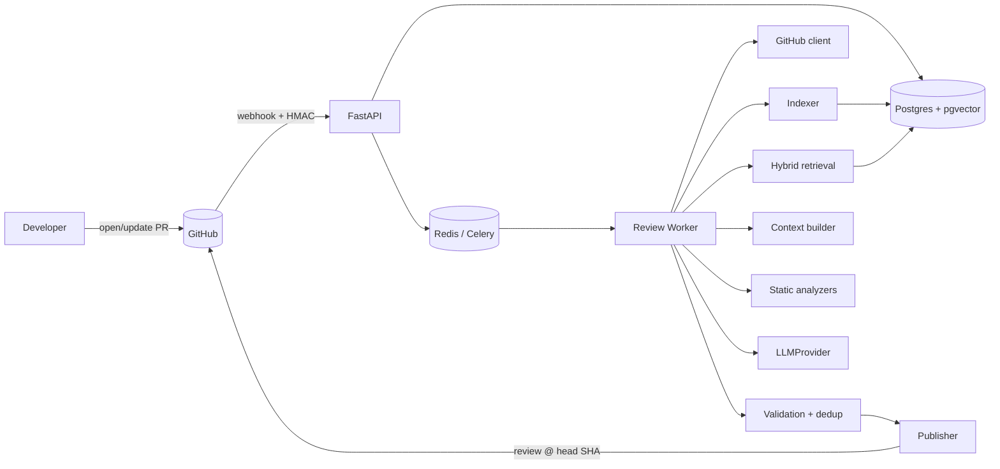
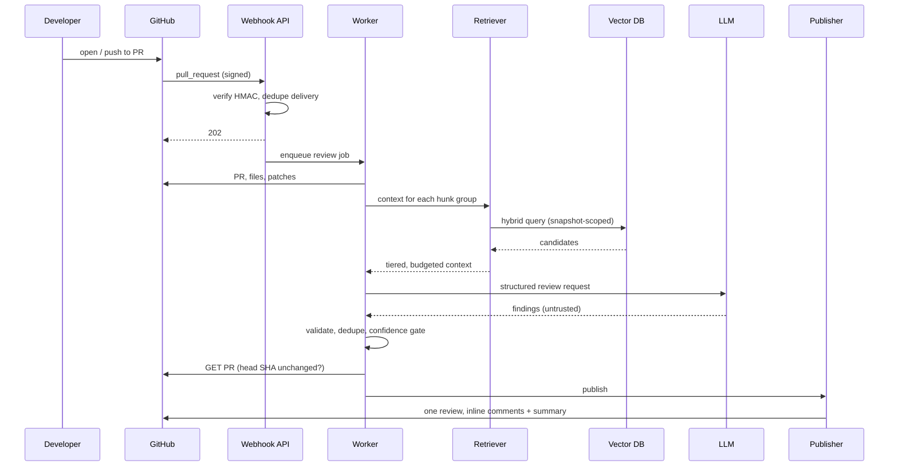

# Architecture

## System

## PR review sequence

## Key decisions
See `docs/decisions/`. Full rationale: the approved planning document (sections 6, 13, 14, 20).

- Index the PR **base** commit; overlay head-version chunks for changed files in memory.
- Chunks are content-addressed by git blob SHA; a snapshot is a `path -> blob_sha` manifest.
- Retrieval: RRF over lexical + vector, plus structural tiers with guaranteed slots.
- The LLM proposes; deterministic validation decides what is published.
